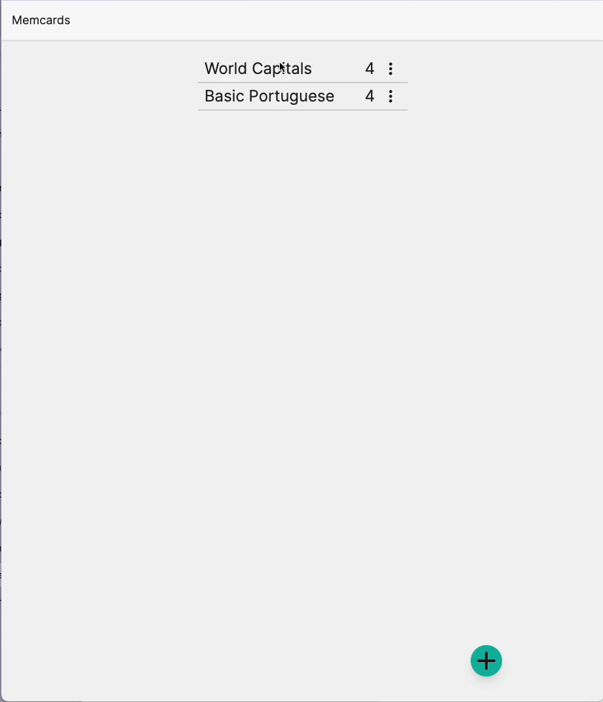

# Memcards

<p align="center">

</p>

[**Memcards**](https://memcards.vercel.app/login) is a minimally designed flashcard app to help you memorize things efficiently.

## Tech Stack

Memcards is developed using a range of technologies, including:

- Next.js
- Tailwind CSS
- TypeScript
- Playwright
- Storybook

## How to run

To get a local build running, you'll need the following:

### Prerequisites

- Git
- Node
- NextJS
- Docker (for Postgres database)

### Installation Steps

```bash
git clone git@github.com:ristomcintosh/memcards-v2.git
cd memcards-v2
cp .env.example .env
npm install
docker compose up -d # start the database
npx prisma migrate dev # setup and seed the database
npm run dev
```

The app should now be running on [http://localhost:3000](http://localhost:3000).

You can login with the test user (created by the [seed script](./prisma/seed.js)):

- Username: `user`
- Password: `password`

<br/>
<br/>
<br/>

<div align="center">
  
</div>
